# Personal Agent Platform PRD

## 1. 한 줄 정의

채팅으로 시작해서, 필요할 때 화면이 생기고, 끝나면 내 주제·기억·맡긴 일로 남는 개인형 Agent 플랫폼.

## 2. 배경

기존 `trip-plan` 앱은 여행이라는 지속 관리 대상이 먼저 있고, 채팅은 그 여행을 쉽게 수정하는 조작면이다. 반대로 일반 질문·요약·비교처럼 한 번 답하고 끝나는 작업은 별도 작업실 없이 채팅만으로 충분하다.

따라서 이 제품의 핵심 UX는 모든 기능을 하나의 메뉴에 욱여넣는 것이 아니라, 사용자의 요청이 단발인지 지속 관리 대상인지 판단하고 적절한 표면으로 자연스럽게 승격시키는 것이다.

## 3. 핵심 원칙

| 원칙 | 설명 |
| --- | --- |
| 단발성은 채팅 | 한 번 읽고 끝나는 답변, 요약, 비교, 짧은 리서치는 채팅 안에서 끝낸다. |
| 지속성은 주제 | 여행, 투자 리서치, 블로그 기획처럼 계속 다듬는 대상은 주제로 저장한다. |
| 산출물은 작업면 | 지도, markmap, 문서, 표, 차트, todo는 채팅 밖 작업면으로 펼친다. |
| 자동화는 맡긴 일 | 장시간 실행, 여러 담당에게 나눠 맡기기, 반복 스케줄은 맡긴 일에서 관리한다. |
| 자료는 기억 | 유튜브, 기사, 블로그, 파일, 결정, 선호도는 기억에 쌓는다. |
| 채팅은 컨트롤 타워 | 채팅에서 주제 조회·생성·전환, 도구 CRUD, 작업 실행, 스케줄 등록까지 가능해야 한다. |

## 4. 사용자 언어와 내부 개념

| 사용자에게 보이는 말 | 내부 개념 |
| --- | --- |
| 오늘 | 전체 홈, 최근 대화, 진행 중 작업 |
| 주제 | workspace / project / data space |
| 작업면 | artifact / canvas / domain view |
| 맡긴 일 | agent run / swarm run / schedule |
| 기억 | knowledge base / source / preference |
| 연결 | MCP / tool / model provider |
| 여러 담당에게 맡기기 | multi-agent / swarm |
| 자동으로 해두기 | scheduler |

## 5. 상위 정보 구조

| 페이지 | 포함 기능 | 목적 |
| --- | --- | --- |
| 오늘 | 채팅, 최근 주제, 진행 중 맡긴 일, 예정된 자동 작업 | 모든 시작점 |
| 주제 | 여행, 투자, 글쓰기, 리서치, todo/markmap | 오래 살아 있는 작업공간 |
| 작업면 | 문서, markmap, 지도, 표, 차트, 캘린더, 보드 | 채팅 결과가 펼쳐지는 표면 |
| 기억 | 유튜브/기사/블로그/파일 스크랩, 결정, 선호도 | 나중에 다시 쓸 자료 |
| 스크랩 | URL, 메모, 파일, 영상, 기사, PDF 수집과 요약 | 기억으로 승격되기 전 자료 inbox |
| 캘린더 | 일정, 반복 자동 작업, 일정 제안, 충돌 조정 | 시간 기반 작업 관리 |
| 할 일 | 목록, 보드, markmap, 체크리스트, 의존성 | 실행 항목 관리 |
| 파일 | 업로드, 타입 분류, 권한, 요약, 첨부 | 로컬/외부 파일 관리 |
| 맡긴 일 | agent run, swarm run, 예약 작업, 모니터링 | 지금/미래에 실행되는 일 |
| 에이전트 | 에이전트 생성, 지침, 모델, 도구, 권한, 테스트 | Dify식 agent builder |
| 연결 | MCP, 외부 API, OpenRouter, Codex app-server, provider | 도구/권한/모델 연결 |
| 설정 | 비용 제한, 안전 정책, 기본 모델, 프로필 | 전역 설정 |
| 도움말 | 가이드, 명령어, Dev Mode 튜토리얼, 시스템 상태 | 사용법과 운영 지원 |

## 6. 채팅 중심 동선

### 6.1 채팅에서 주제로 이동

```text
사용자: 저번에 작업하던 여행 목록 보여줘
→ list_topics(type=travel)
→ 여행 목록 카드 표시

사용자: 도쿄 여행 편집하자
→ active topic = 도쿄 여행
→ "도쿄 여행 작업실로 이동 중입니다" 전환 화면
→ 도쿄 여행 주제 화면 진입
→ 이후 대화는 도쿄 여행에 귀속
```

### 6.2 채팅에서 도구 CRUD

```text
사용자: 스크랩 목록 알려줘
→ list_sources()
→ 자료 카드 표시

사용자: 이 유튜브를 도쿄 여행에 연결해줘
→ attach_source_to_topic(sourceId, topicId)
→ 기억과 주제 양쪽에서 조회 가능

사용자: 항공권 가격 매일 확인해줘
→ create_schedule(topicId, tool=flight_price_watch)
→ 맡긴 일에 예약 작업 생성
```

### 6.3 주제에서 채팅

```text
주제: 도쿄 여행
→ 지도/일정 작업면이 열림
→ 오른쪽 또는 하단 채팅에서 "2일차를 덜 빡세게 바꿔줘"
→ AI가 operation 제안
→ 사용자가 적용
→ 일정/지도 갱신, 체크포인트 저장
```

## 7. 화면 승격 규칙

| 요청/결과 성격 | 기본 표면 |
| --- | --- |
| 짧은 답변, 요약, 비교 | 채팅 inline |
| 긴 문서, 블로그 초안, 리포트 | 작업면 |
| 지도, 여행 일정, 투자 차트 | 주제 + 작업면 |
| todo, markmap, 표 | 채팅 카드 + 작업면 |
| 반복 실행, 모니터링 | 맡긴 일 |
| 외부 계정, 쓰기 작업, 예약, 결제 | 연결/승인 카드 |
| 여러 담당 조사, 병렬 검증 | 맡긴 일 timeline |

## 8. 주요 화면

### 8.0 시각 방향 샘플

완성형에 가까운 PC 화면 톤이다. 채팅을 중심에 두되, 오른쪽에는 진행 중인 맡긴 일과 예정된 자동 작업을 고정해서 컨트롤 타워 느낌을 만든다.

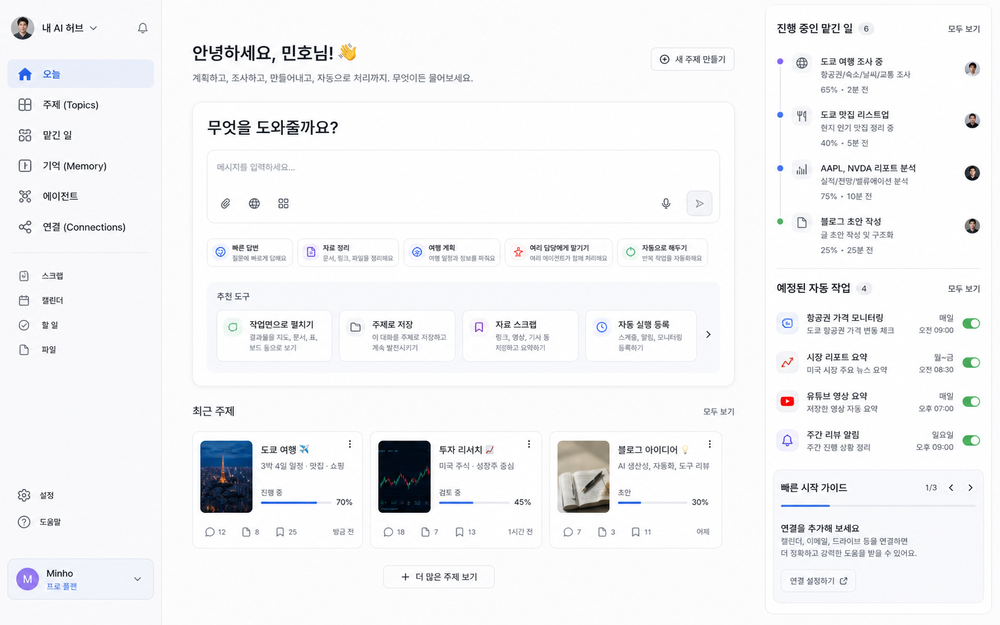

### 8.1 오늘 / 컨트롤 타워

첫 진입점이다. 사용자는 기능 메뉴를 먼저 고르지 않고 채팅으로 시작한다. 최근 주제, 진행 중인 맡긴 일, 예정된 자동 작업을 같이 보여준다.

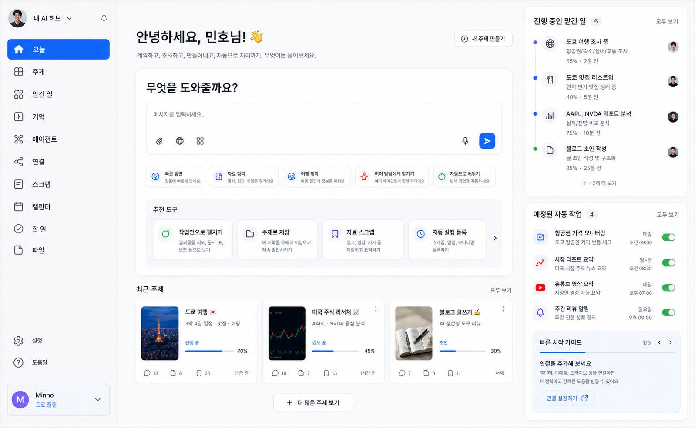

### 8.2 채팅에서 주제로 이동

채팅에서 주제 목록을 조회하고, 사용자가 특정 주제를 편집하겠다고 하면 작업실 전환 화면을 보여준다. 이때 현재 대화가 어느 주제에 귀속되는지 명확히 알려준다.

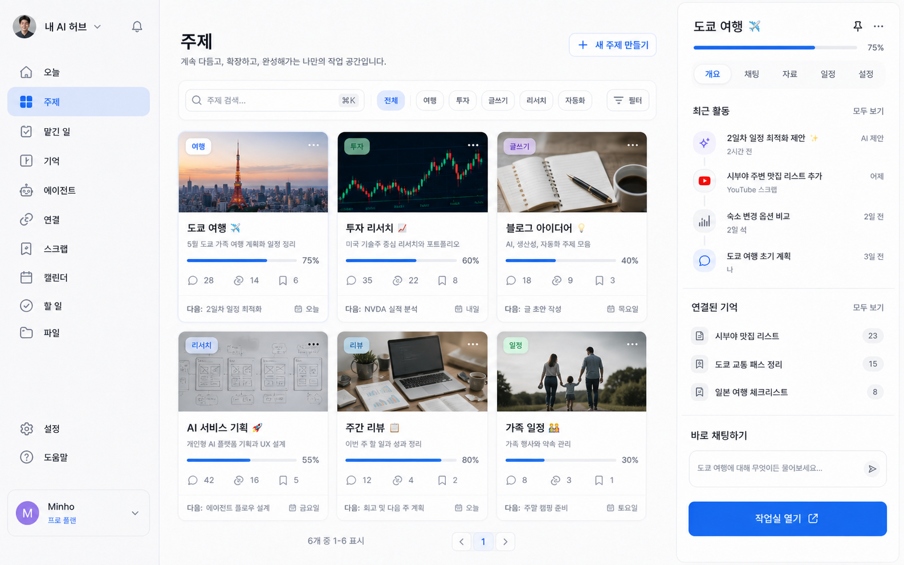

### 8.3 주제 공통 셸

모든 지속 작업은 같은 골격을 가진다. 좌측은 주제 안의 대화/작업/자료/결과물/자동화, 중앙은 채팅 또는 주요 흐름, 우측은 작업면이다.


### 8.4 여행 주제 작업면

기존 `trip-plan`의 강점을 살린다. 여행은 워크스페이스가 먼저이고, 채팅은 일정과 지도를 쉽게 바꾸는 조작면이다.


### 8.5 맡긴 일

장시간 실행, 여러 담당에게 나눠 맡기기, 예약 작업을 모아 보는 화면이다. 사용자에게는 swarm보다 "여러 담당에게 나눠 맡기기"로 표현한다.

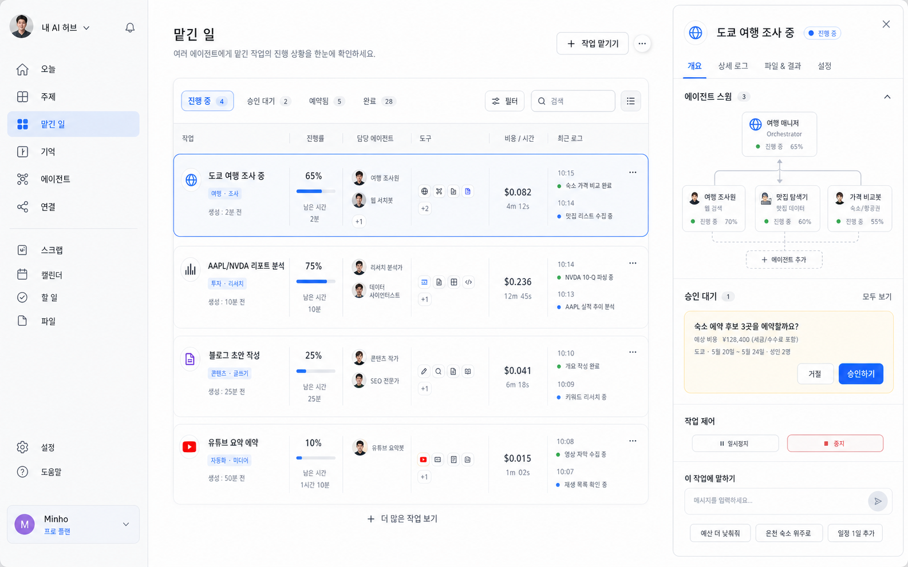

### 8.6 기억 / 스크랩 자료

스크랩은 단순 저장이 아니라 나중에 써먹을 재료 넣기다. 자료는 요약, 태그, 연결된 주제, 후속 액션을 가진다.

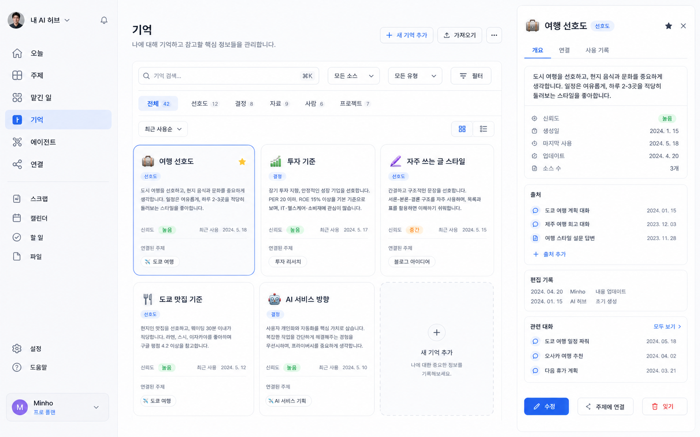

### 8.7 에이전트 빌더

Dify처럼 에이전트 생성/편집 화면을 제공한다. 역할, 지침, 도구, 권한, 실행 방식, 테스트 채팅을 한 화면에서 다룬다.

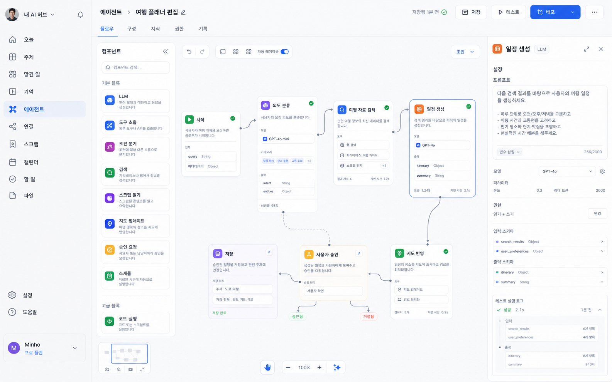

### 8.8 연결 / 도구 / 모델

MCP, 외부 API, 모델 제공사, 권한 정책을 관리한다. 일반 사용 동선에서는 숨기되, agent builder와 scheduler가 여기를 참조한다.

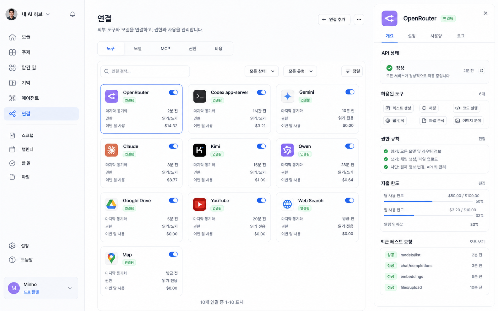

## 9. 기능 카테고리

| 카테고리 | 기능 |
| --- | --- |
| 채팅 | 일반 Q&A, 요약, 번역, 비교, 짧은 리서치 |
| 주제 | 여행 계획, 투자 리서치, 글쓰기, 리서치 보드, todo/markmap |
| 작업면 | 지도, 일정표, 문서, 표, 차트, markmap, source card |
| 기억 | 유튜브 스크랩, 기사 스크랩, 블로그 스크랩, 파일, 결정, 선호도 |
| 맡긴 일 | agent run, multi-agent run, 반복 스케줄, 모니터링, 승인 대기 |
| 에이전트 | agent profile, prompt, tools, model, knowledge, permissions, test chat |
| 연결 | MCP servers, tool registry, OpenRouter, Codex app-server, direct providers |

## 10. 에이전트 빌더 요구사항

| 섹션 | 필드 |
| --- | --- |
| 기본 정보 | 이름, 설명, 아이콘, 용도 |
| 지침 | system prompt, 말투, 금지사항 |
| 모델 | provider, model, reasoning, temperature |
| 도구 | MCP tool, scraper, search, map, stock, filesystem |
| 지식 | 연결할 자료, 주제, 파일 |
| 실행 방식 | 단발, 주제 전용, 반복 실행, 여러 담당 참여 |
| 권한 | 읽기 전용, 쓰기 가능, 승인 필요 |
| 출력 | 채팅 답변, 문서, markmap, 표, 지도, todo |
| 테스트 | 오른쪽 테스트 채팅 |
| 기록 | 최근 run, 실패, 비용, 소요시간 |

## 11. 내부 객체 모델 초안

| 객체 | 설명 |
| --- | --- |
| `conversation` | 모든 채팅 대화 |
| `topic` | 오래 살아 있는 주제, 기존 data space/workspace |
| `surface` | 작업면 타입과 상태 |
| `artifact` | 대화나 실행 결과로 만들어진 산출물 |
| `source` | 기억에 저장된 자료 |
| `tool` | 채팅/에이전트가 호출 가능한 기능 |
| `agent` | 특정 방식으로 tool을 쓰는 실행자 |
| `run` | agent/tool 실행 기록 |
| `schedule` | run을 반복 실행하는 규칙 |
| `provider` | OpenRouter, Codex app-server, direct API |
| `connection` | 외부 서비스, MCP server, provider 연결 |
| `credential` | API key, OAuth 계정, 자체 API token |
| `file_asset` | 업로드 파일, 외부 파일, 생성 파일 |
| `task` | 할 일, 카드, 맵 노드의 공통 실행 항목 |
| `checklist` | task 내부 체크 항목 |
| `dependency` | task 간 선후행 관계 |
| `calendar_event` | 수동 일정과 자동 작업이 캘린더에 노출되는 단위 |
| `document` | 리포트, 초안, 문서형 artifact |
| `citation` | document 문장과 source 근거의 연결 |
| `approval_request` | 외부 쓰기, 비용 초과, 예약 실행 전 승인 단위 |
| `audit_log` | 키 변경, 권한 변경, run 제어, token 사용 기록 |

모든 채팅은 scope를 가진다.

```text
global chat
topic chat
tool chat
agent test chat
run chat
```

## 12. MVP 제안

### Phase 1

| 우선순위 | 기능 |
| --- | --- |
| 1 | 오늘 화면 + 전역 채팅 |
| 2 | 채팅에서 여행 주제 목록 조회 |
| 3 | 채팅에서 여행 주제로 이동 |
| 4 | 여행 주제 안에서 기존 trip-plan 편집 |
| 5 | 작업면 전환 카드 |

### Phase 2

| 우선순위 | 기능 |
| --- | --- |
| 1 | 기억/스크랩 자료 목록 |
| 2 | 채팅에서 자료 조회/연결 |
| 3 | 맡긴 일 timeline |
| 4 | 반복 작업 mock 등록 |
| 5 | 에이전트 빌더 1차 |

### Phase 3

| 우선순위 | 기능 |
| --- | --- |
| 1 | MCP/tool registry |
| 2 | scheduler 실제 실행 |
| 3 | multi-agent run |
| 4 | 투자 주제 |
| 5 | model/provider cost monitoring |

## 13. 오픈 질문

| 질문 | 후보 |
| --- | --- |
| 최상위 메뉴를 `오늘/주제/맡긴 일/기억`으로 최소화할지 | 고급 메뉴는 설정 안에 숨김 |
| 작업면을 오른쪽 패널로 둘지, 중앙 주 표면으로 둘지 | 주제 타입별로 다르게 허용 |
| 여행 앱을 새 shell 안에 통합할지, 별도 route로 유지할지 | 기존 완성도 보존 위해 route 유지 후 shell 통합 |
| 에이전트 빌더를 초기에 넣을지 | 초기에는 read-only 템플릿, Phase 2에서 편집 |
| 자동화 권한 모델 | 읽기 자동, 쓰기 승인, 외부 계정 항상 승인 |

## 14. 실제형 사이드 메뉴 화면 예시

왼쪽 사이드 메뉴 12개를 기준으로 만든 실제 서비스 톤의 PC 화면 예시다. 구현 시에는 이 화면들을 그대로 만들기보다, 정보 밀도·패널 배치·오른쪽 상세 패널의 존재감을 기준으로 삼는다.

### 14.1 오늘


### 14.2 주제


### 14.3 맡긴 일


### 14.4 기억


### 14.5 에이전트

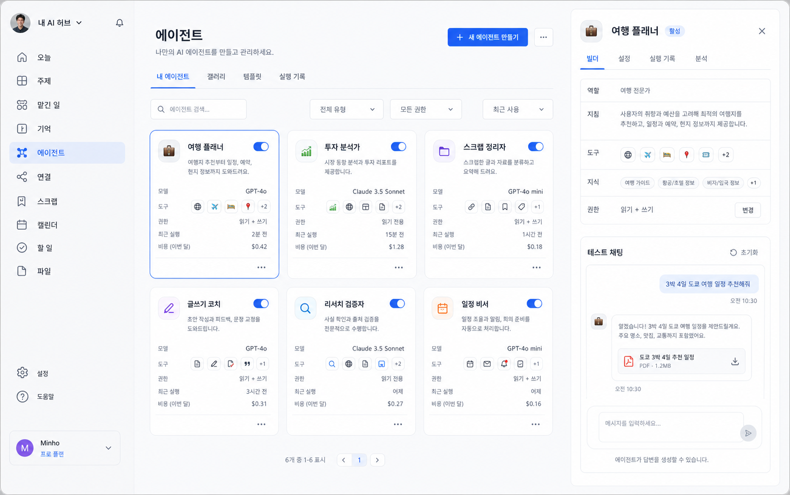

### 14.6 연결


### 14.7 스크랩

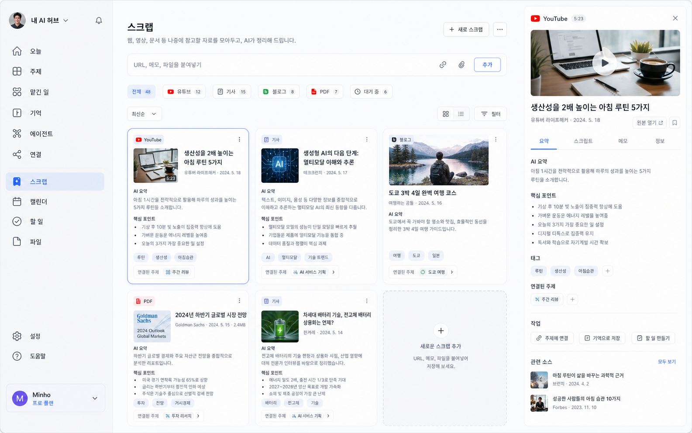

### 14.8 캘린더

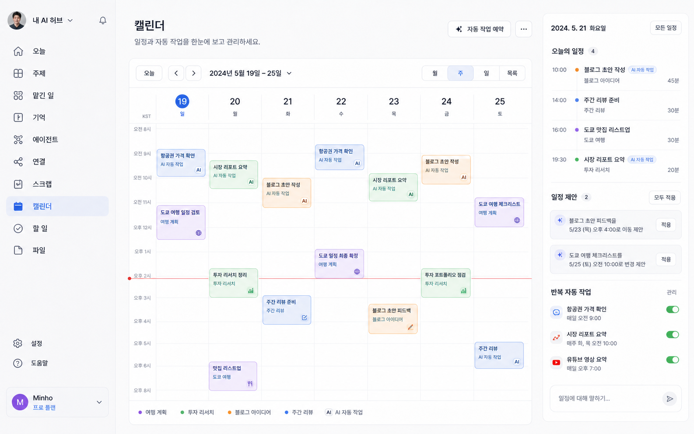

### 14.9 할 일

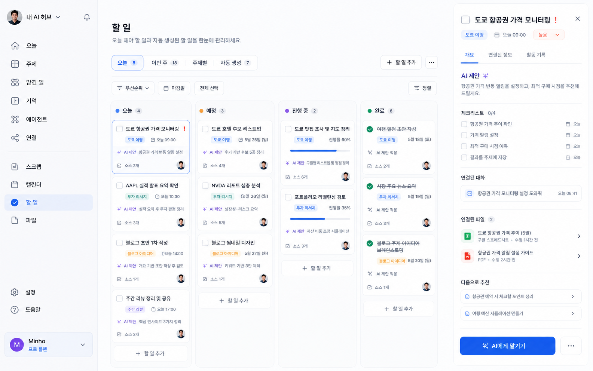

### 14.10 파일

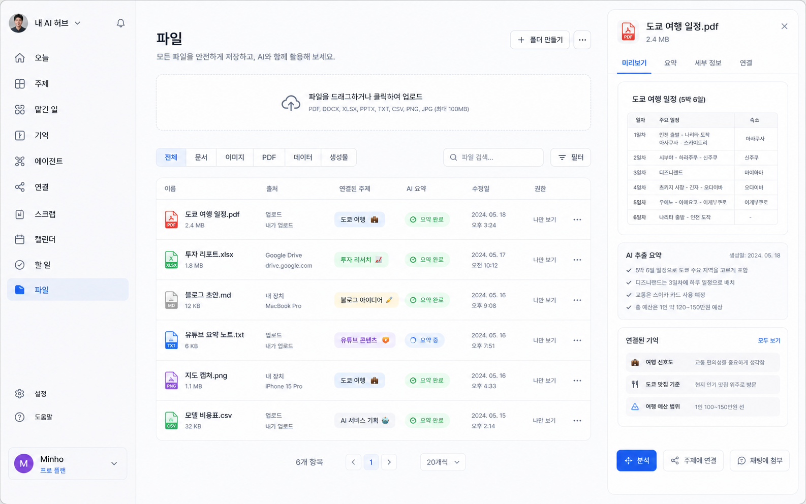

### 14.11 설정

설정 화면은 단순 개인 설정이 아니라 모델 접속·비용·보안·개발자 접근을 관리하는 운영 콘솔에 가깝다.

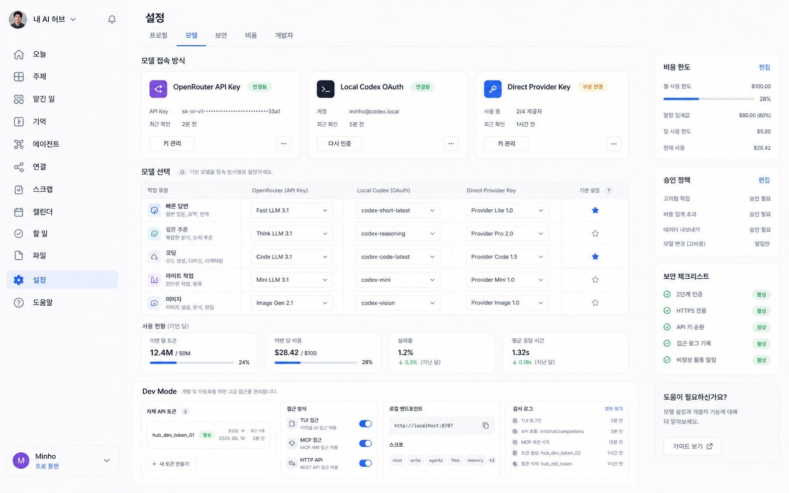

### 14.12 도움말

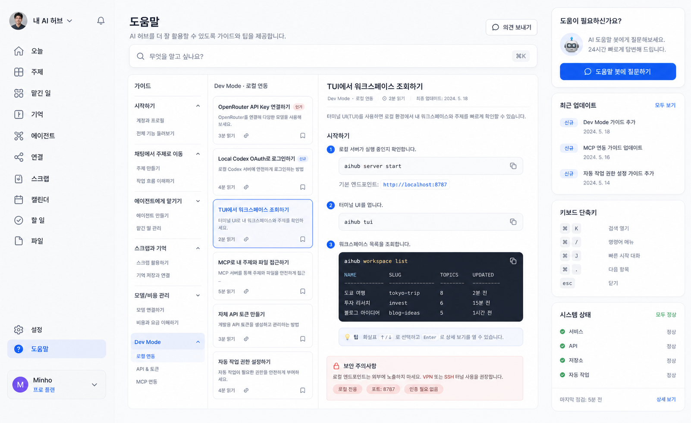

## 15. 추가 화면 실험

### 15.1 에이전트 생성/편집 무한캔버스

에이전트 탭 하위의 고급 편집 화면이다. Dify처럼 블록을 조립하되, 개인 워크스페이스의 자료·도구·권한·스케줄을 한 화면에서 연결한다.


### 15.2 할 일 맵

할 일 탭 하위의 markmap형 시각화 화면이다. 목록/보드와 별개로, 큰 목표와 세부 작업의 관계·의존성·진행률을 볼 수 있게 한다.

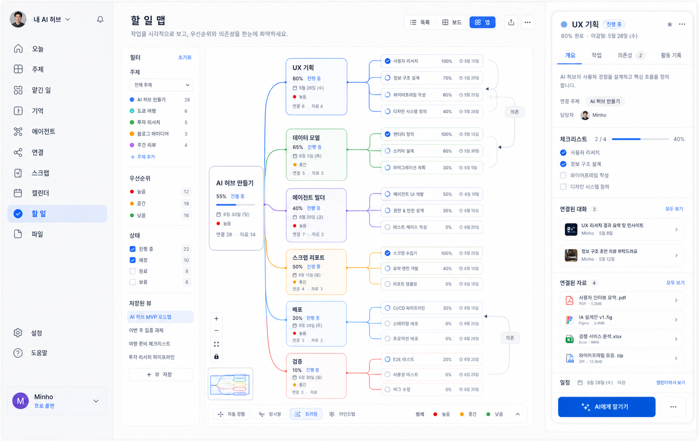

### 15.3 지식 기반 리포트 빌더

스크랩과 기억을 기반으로 리포트나 문서를 만드는 화면이다. 초기에는 `스크랩 > 리포트 만들기` 하위 화면으로 두고, 사용 빈도가 높아지면 `문서` 또는 `작성` 메뉴로 승격할 수 있다.

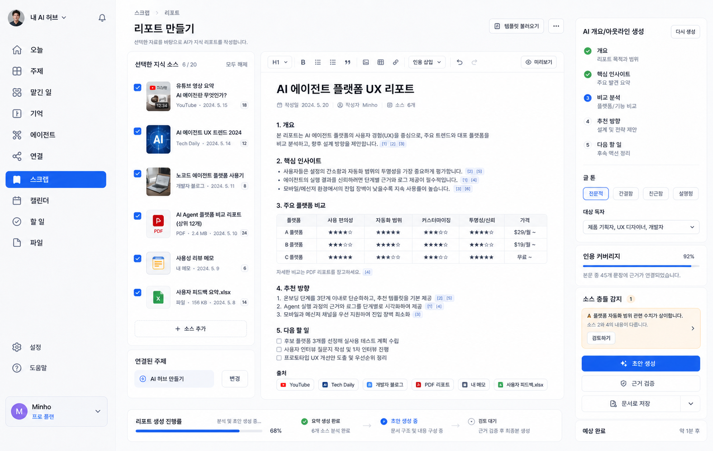

## 16. 설정과 Dev Mode 요구사항

| 영역 | 요구사항 |
| --- | --- |
| OpenRouter | API Key 저장, 마스킹 표시, 키 검증, 사용량 조회, 모델별 기본 용도 매핑 |
| Local Codex OAuth | 로컬 Codex 인증 상태 표시, 계정 재인증, app-server 방식의 사용 가능 모델 표시 |
| Direct Provider Key | Gemini, Claude, OpenAI, Kimi 등 직접 연결 키를 선택적으로 저장 |
| 모델 선택 | 빠른 답변, 깊은 추론, 코딩, 라이트 작업, 이미지 생성 용도별 기본 모델 지정 |
| 사용량 | 월간 토큰, 비용, 실패율, 평균 응답 시간, provider별 비용 한도 표시 |
| 승인 정책 | 외부 쓰기 작업, 결제, 파일 삭제, 예약 실행은 승인 정책을 별도로 둔다 |
| Dev Mode | 자체 API Token 발급/폐기, scope 관리, 만료일, audit log 제공 |
| 로컬 접근 | TUI, MCP, localhost API가 워크스페이스·주제·파일·할 일에 접근 가능해야 한다 |
| 보안 | 토큰은 한 번만 원문 노출, 이후 마스킹, 권한별 read/write 분리 |

## 17. 이미지 분석 기반 반영 체크

5개 분석 그룹이 15개 실제형 화면을 나눠 검토한 결과, 현재 PRD는 방향성·상위 IA·이미지 링크는 충분하지만 화면별 세부 요구사항, 상태 모델, 객체 관계는 대부분 부분 반영 상태다.

| 화면 | 현재 반영 상태 | PRD에 이미 있는 것 | 보강한/보강할 요구사항 |
| --- | --- | --- | --- |
| 오늘 | 부분 반영 | 컨트롤 타워, 전역 채팅, 최근 주제, 맡긴 일, 자동 작업 | 입력창 액션, 빠른 실행, 추천 도구, 자동 작업 토글, 온보딩 카드 |
| 주제 | 부분 반영 | 지속형 workspace, 주제 이동, 주제 안 채팅 | 검색/필터, 카드 메타데이터, 진행률, 최근 활동, 상세 패널 탭 |
| 맡긴 일 | 부분 반영 | run, schedule, multi-agent, 승인 필요 | run 상태, 로그, 비용/시간, 일시정지/재개/중지, 승인 payload |
| 기억 | 부분 반영 | source, preference, 결정, 선호도 | 신뢰도, 출처, 관련 대화, 편집 이력, 즐겨찾기, 잊기 정책 |
| 에이전트 | 부분 반영 | agent profile, prompt, tool, model, test chat | 갤러리/템플릿, 활성 상태, 월 비용, 분석 탭, 테스트 산출물 |
| 연결 | 부분 반영 | MCP, OpenRouter, provider, 권한 | health check, 허용 도구 매핑, 권한 rule, 테스트 로그, 비활성화 영향 |
| 스크랩 | 부분 반영 | 유튜브/기사/블로그 스크랩, 요약, 태그, 주제 연결 | 처리 상태, 원문/스크립트, 미디어 메타데이터, 관련 소스 추천 |
| 캘린더 | 부분 반영 | schedule, 반복 작업, 캘린더 작업면 | 수동 일정+자동 작업 통합, 충돌 감지, 제안 적용, 반복 작업 토글 정책 |
| 할 일 | 부분 반영 | todo, markmap, 작업면 | task 상태, 칸반 필드, 체크리스트, AI 제안 이력, AI에게 맡기기 결과 |
| 파일 | 부분 반영 | 파일은 source/기억으로 사용 | 업로드, 타입 분류, 요약 상태, 권한, 파일 상세, 채팅 첨부 |
| 설정 | 부분 반영 | 모델/비용/Dev Mode 요구 | 탭별 범위, 모델 라우팅 매트릭스, 토큰 생명주기, 비용 차단 조건 |
| 도움말 | 누락에 가까움 | 이미지 예시, Dev Mode 요구 | 검색, 가이드 IA, 명령어 복사, 도움말 봇, 업데이트, 시스템 상태 |
| 에이전트 무한캔버스 | 부분 반영 | Dify식 편집, 도구/권한/테스트 | 노드/엣지, 드래프트/테스트/배포, 노드 로그, 스키마 검증 |
| 할 일 맵 | 부분 반영 | markmap형 할 일 화면 | 목록/보드/맵 전환, 저장 뷰, 의존성, 상세 패널, 필터 |
| 리포트 빌더 | 부분 반영 | 스크랩/기억 기반 문서 생성 | 인용, 근거 검증, 소스 충돌, 인용 커버리지, 문서 승격 기준 |

## 18. 화면별 기능 요구사항

### 18.1 오늘

| 영역 | 요구사항 |
| --- | --- |
| 전역 채팅 | 텍스트, 첨부, 웹 검색, 도구 선택, 음성 입력, 전송 액션을 제공한다 |
| 빠른 실행 | 빠른 답변, 자료 정리, 여행 계획, 여러 담당에게 맡기기, 자동 실행을 프리셋으로 제공한다 |
| 추천 도구 | 작업면으로 펼치기, 주제로 저장, 자료 스크랩, 자동 실행 등록을 카드로 노출한다 |
| 최근 주제 | 썸네일, 진행 상태, 진행률, 대화 수, 자료 수, 북마크 수, 최근 수정 시간을 보여준다 |
| 우측 패널 | 진행 중 맡긴 일, 예정된 자동 작업, 연결 가이드를 항상 볼 수 있게 한다 |
| 자동 작업 토글 | 토글 변경 시 권한 정책, 다음 실행 시간, audit log를 남긴다 |

### 18.2 주제

| 영역 | 요구사항 |
| --- | --- |
| 목록 탐색 | 검색, 카테고리 필터, 상태 필터, 페이지네이션, 새 주제 만들기를 제공한다 |
| 주제 카드 | 유형, 설명, 진행률, 다음 액션, 마감일, 연결 자료 수, 최근 활동을 표시한다 |
| 상세 패널 | 개요, 채팅, 자료, 일정, 설정 탭을 제공한다 |
| 활동 | 대화, 자료 연결, 자동 작업 생성, 체크포인트, artifact 생성 기록을 timeline으로 보여준다 |
| 주제 진입 | `빠른 채팅`은 lightweight 질의, `작업실 열기`는 full workspace 진입으로 구분한다 |

### 18.3 맡긴 일

| 영역 | 요구사항 |
| --- | --- |
| 상태 | 진행 중, 승인 대기, 예약됨, 완료, 실패, 중지, 일시정지 상태를 가진다 |
| 목록 | 생성 시간, 진행률, 남은 시간, 담당 에이전트, 사용 도구, 비용, 실행 시간, 최근 로그를 표시한다 |
| 상세 | 개요, 상세 로그, 파일/결과, 설정 탭을 제공한다 |
| 제어 | 일시정지, 재개, 중지, 재시도, 에이전트 추가를 지원한다 |
| 승인 | 비용, 외부 쓰기 대상, 예상 변경, 권한 scope, 승인/거절 결과를 기록한다 |
| 대화 | run scope 채팅을 제공하고 명령은 해당 run에만 적용한다 |

### 18.4 기억

| 영역 | 요구사항 |
| --- | --- |
| 유형 | 선호도, 결정, 자료, 사람, 프로젝트로 분류한다 |
| 메타데이터 | 신뢰도, 생성일, 마지막 사용일, 업데이트일, source 수를 가진다 |
| 상세 | 출처, 관련 주제, 관련 대화, 편집 이력, 사용 기록을 보여준다 |
| 액션 | 수정, 주제에 연결, source 추가, 즐겨찾기, 잊기를 제공한다 |
| 잊기 | 완전 삭제, AI 참조 제외, 보관 중 하나로 명확히 선택하게 한다 |

### 18.5 에이전트

| 영역 | 요구사항 |
| --- | --- |
| 탐색 | 내 에이전트, 갤러리, 템플릿, 실행 기록 탭을 제공한다 |
| 카드 | 모델, 도구, 지식, 권한, 최근 실행, 월 비용, 활성 상태를 보여준다 |
| 템플릿 | 복제, 수정, 배포, 소유권, 공개 범위를 관리한다 |
| 테스트 | 테스트 채팅, reset, 테스트 결과 저장, 산출물 다운로드를 제공한다 |
| 분석 | 성공률, 평균 지연, 월 비용, 자주 실패한 tool, 최근 run을 보여준다 |

### 18.6 연결

| 영역 | 요구사항 |
| --- | --- |
| 분류 | model provider, tool service, MCP server, storage, search, map을 구분한다 |
| 카드 | 연결 상태, 활성 토글, 최근 상태 확인, 권한, 월 사용 비용을 보여준다 |
| 상세 | API health check, 허용 tool/capability, 권한 rule, 비용 한도, 테스트 요청 로그를 제공한다 |
| 비활성화 | 연결을 끄면 영향받는 agent, schedule, run을 미리 보여준다 |
| 권한 | read, write, approve-required, blocked rule을 connection별로 설정한다 |

### 18.7 스크랩

| 영역 | 요구사항 |
| --- | --- |
| 추가 | URL, 메모, 파일, 영상, 기사, 블로그, PDF를 입력받는다 |
| 처리 | 대기 중, 처리 중, 완료, 실패, 재시도 상태를 가진다 |
| 요약 | AI 요약, 핵심 포인트, 태그, 원문, 스크립트, 메모, 메타데이터를 생성한다 |
| 액션 | 원본 열기, 북마크, 주제 연결, 기억 저장, 할 일 만들기, 관련 소스 추천을 제공한다 |
| 관계 | 스크랩은 원자료 inbox이고, 검증/요약/선택 후 기억이나 문서 재료로 승격된다 |

### 18.8 캘린더

| 영역 | 요구사항 |
| --- | --- |
| 보기 | 월, 주, 일, 목록 뷰를 제공한다 |
| 이벤트 | 수동 일정과 자동 작업을 같은 시간축에 표시하되 권한 차이를 명확히 구분한다 |
| 제안 | 일정 충돌, 빈 시간, 리스케줄, 일괄 적용/개별 적용 제안을 제공한다 |
| 반복 | 반복 자동 작업은 일시중지, 재개, 실패, 다음 실행 시간을 가진다 |
| 자연어 | 자연어 입력으로 일정 생성, 일정 수정, 자동 작업 예약을 요청할 수 있다 |

### 18.9 할 일

| 영역 | 요구사항 |
| --- | --- |
| 보기 | 목록, 보드, 맵을 같은 task 데이터로 전환한다 |
| 카드 | 상태, 우선순위, 마감일, 주제, 담당자, 소스 수, 대화 수, 진행률을 표시한다 |
| 상세 | 체크리스트, 관련 대화, 관련 파일, 활동 기록, 일정, 다음 추천을 제공한다 |
| AI 제안 | 제안됨, 적용됨, 거절됨, 보류 상태와 적용 이력을 가진다 |
| AI에게 맡기기 | task에서 run을 생성하고, 필요하면 schedule로 반복 실행한다 |

### 18.10 파일

| 영역 | 요구사항 |
| --- | --- |
| 업로드 | 문서, 이미지, PDF, 데이터, 생성물을 업로드하고 타입별로 분류한다 |
| 출처 | 로컬, 외부 drive, 모바일, 생성물, 스크랩 출처를 구분한다 |
| 상태 | 요약 대기, 요약 중, 요약 완료, 실패, 권한 제한 상태를 가진다 |
| 상세 | 미리보기, 추출 요약, 연결된 기억, 연결된 주제, 권한, 변경 이력을 보여준다 |
| 액션 | 분석, 주제에 연결, 채팅에 첨부, 기억 추출, 권한 변경을 제공한다 |

### 18.11 설정

| 영역 | 요구사항 |
| --- | --- |
| 탭 | 프로필, 모델, 보안, 비용, 개발자 탭의 책임을 분리한다 |
| 접속 방식 | OpenRouter API Key, Local Codex OAuth, Direct Provider Key를 병렬 관리한다 |
| 모델 라우팅 | 빠른 답변, 깊은 추론, 코딩, 라이트 작업, 이미지 생성별 기본 모델을 선택한다 |
| 비용 | 월 한도, 일 한도, 알림 임계값, 차단 조건, provider별 사용량을 제공한다 |
| 보안 | 2단계 인증, HTTPS, API key rotation, 접근 로그, 비정상 활동 알림 상태를 보여준다 |
| Dev Mode | 자체 API token, TUI, MCP, HTTP API, scope, 만료, 마지막 사용일, audit log를 관리한다 |

### 18.12 도움말

| 영역 | 요구사항 |
| --- | --- |
| 검색 | 도움말 검색과 문서 바로가기를 제공한다 |
| IA | 시작하기, 주제 이동, 맡긴 일, 스크랩/기억, 모델/비용, Dev Mode 카테고리를 가진다 |
| 문서 | breadcrumb, 최종 업데이트, 읽기 시간, 즐겨찾기, 공유 링크, 피드백을 제공한다 |
| 튜토리얼 | 복사 가능한 명령어, TUI 예시, MCP 예시, localhost endpoint 예시를 포함한다 |
| 지원 | 도움말 봇, 최근 업데이트, 키보드 단축키, 시스템 상태를 제공한다 |

## 19. 고급 화면 요구사항

### 19.1 에이전트 무한캔버스

| 영역 | 요구사항 |
| --- | --- |
| 캔버스 | 노드 추가, 엣지 연결, 자동 레이아웃, 미니맵, 줌, 되돌리기/다시하기를 제공한다 |
| 노드 | LLM, tool call, 조건 분기, 검색, 스크랩 읽기, 지도 업데이트, 승인 요청, 스케줄, 코드 실행 노드를 제공한다 |
| 설정 | 노드별 prompt, model, parameter, permission, input/output schema를 설정한다 |
| 관측 | 노드별 성공률, 토큰, 지연 시간, 입력/출력, 실행 로그를 보여준다 |
| 라이프사이클 | 초안, 테스트, 배포, 보관 상태를 가진다 |
| 분기 | 조건 분기와 승인/거절 분기는 edge rule과 fallback path를 명시한다 |

### 19.2 할 일 맵

| 영역 | 요구사항 |
| --- | --- |
| 구조 | task, subtask, dependency를 markmap 형태로 보여준다 |
| 보기 | 목록, 보드, 맵 간 데이터가 동일해야 하며, view만 달라진다 |
| 필터 | 주제, 우선순위, 상태, 담당자, 마감일 필터와 저장된 view를 제공한다 |
| 노드 | 진행률, 상태, 마감일, 우선순위, 연결 자료 수, 의존성을 표시한다 |
| 상세 | 선택 노드의 체크리스트, 대화, 자료, 일정, run 연결을 보여준다 |

### 19.3 지식 기반 리포트 빌더

| 영역 | 요구사항 |
| --- | --- |
| 소스 선택 | 스크랩, 기억, 파일, 메모, 기존 문서를 다중 선택한다 |
| 편집기 | 제목, 목록, 표, 이미지, 링크, 인용, 미리보기를 지원한다 |
| 생성 | 개요 생성, 초안 생성, 비교 분석, 추천 방향, 다음 할 일을 단계적으로 생성한다 |
| 검증 | citation, 인용 커버리지, 근거 검증, 소스 충돌 감지를 제공한다 |
| 옵션 | 글 톤, 대상 독자, 템플릿, 출력 형식을 선택한다 |
| 승격 | 사용 빈도가 높아지면 `스크랩 > 리포트`에서 `문서` 또는 `작성` 메뉴로 승격한다 |

## 20. 공통 상태와 정책

### 20.1 공통 Registry 패턴

에이전트, 연결, 기억, 스크랩, 파일은 공통적으로 검색, 필터, 정렬, 카드/리스트 전환, 우측 상세 패널, overflow 액션, pagination을 가진다.

### 20.2 공통 상태 모델

| 대상 | 상태 |
| --- | --- |
| `run` | queued, running, waiting_approval, paused, succeeded, failed, stopped, retrying |
| `source` | pending, processing, summarized, failed, archived |
| `task` | backlog, today, scheduled, in_progress, blocked, done, archived |
| `calendar_event` | proposed, confirmed, declined, rescheduled, cancelled |
| `document` | outline, drafting, verifying, review_waiting, published, archived |
| `credential` | connected, partial, expired, revoked, error |
| `connection` | healthy, degraded, disabled, error |
| `ai_suggestion` | proposed, applied, rejected, snoozed |
| `approval_request` | requested, approved, rejected, expired |

### 20.3 승인 카드 표준

| 필드 | 설명 |
| --- | --- |
| 대상 | 어떤 주제, 파일, 일정, 외부 서비스에 영향을 주는지 |
| 변경 내용 | 실행 전/후 차이 또는 예상 operation |
| 권한 | read, write, external_write, cost_increase, schedule_change |
| 비용 | 예상 토큰, 예상 금액, 한도 초과 여부 |
| 실행 범위 | 1회성, 반복, 특정 run, 특정 agent |
| 결과 | 승인, 거절, 만료, 자동 취소와 audit log |

### 20.4 용어 경계

| 용어 | 경계 |
| --- | --- |
| 스크랩 | 원자료 inbox. 처리 전/후 자료와 원문을 보관한다 |
| 기억 | 검증되었거나 반복 사용 가치가 있는 요약·결정·선호도 |
| 파일 | 업로드/외부 파일 객체. 스크랩이나 기억의 근거가 될 수 있다 |
| 문서 | source를 근거로 새로 만든 report/artifact |
| 도구 | agent가 호출하는 기능 단위 |
| 모델 제공사 | OpenRouter, Codex app-server, direct provider 같은 LLM 접속 경로 |
| MCP | 외부 기능을 tool로 노출하는 protocol/server |
| 할 일 | 사용자가 관리하는 실행 항목 |
| 맡긴 일 | agent/run/schedule이 실제로 수행하는 실행 기록 |

### 20.5 이미지 레퍼런스 주의사항

실제형 이미지는 방향성 레퍼런스다. 작은 텍스트 오타, 불명확한 아이콘, 일부 상태 충돌은 구현 기준이 아니며, 이 PRD의 용어·상태 모델·권한 정책을 우선한다.
